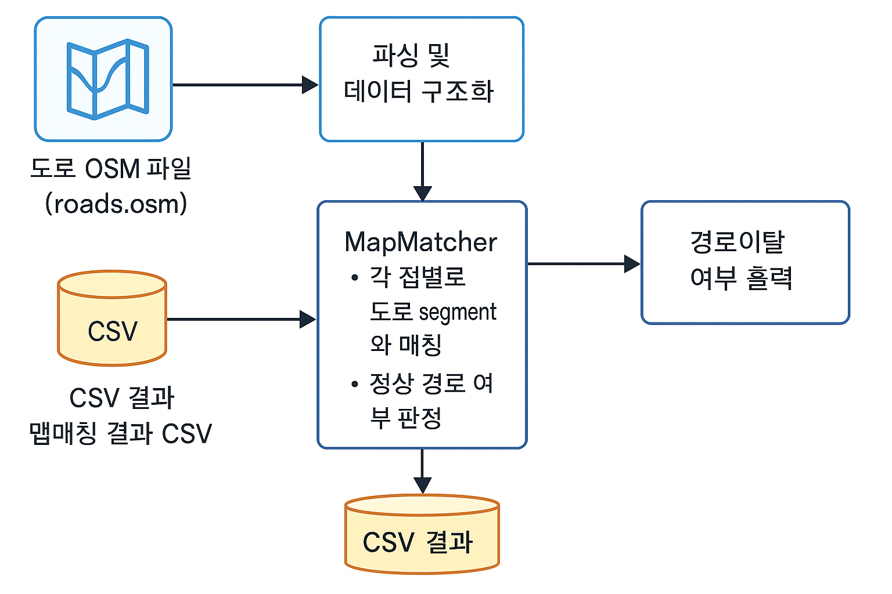

# GPS Map Matching Project

## 👤 내 정보

- **이름:** 유상록
- **나이:** 26세
- **전화번호:** 010-8269-8150
- **이메일:** dbtkdfhr2000@naver.com

---

## 📝 프로젝트 개요

### 1. 목적

- 도로 네트워크(OSM 포맷)와 차량의 GPS 로그(CSV)를 활용하여  
  **GPS 좌표를 가장 가까운 도로선(way segment)에 맵매칭**
  - 오차가 심한 값(멀티패스, 고층건물 지역 등)도 **정상 경로 위에 있으면 ‘정상’으로 간주**
  - **경로선(5개 way id) 외 도로에 매칭된 경우만 ‘경로 이탈’로 판정**

### 2. 주요 기능

- OSM 도로 데이터 파싱
- GPS 로그 파싱 및 맵매칭
- 경로이탈(Deviation) 자동 판정 및 CSV 결과 출력
- 현실성 있는 이탈 허용(5번 연속 이탈 전에 정상 경로로 들어오면 '정상')

### 3. 판정 기준

- **정상 경로선:**  
  521766182, 990628459, 472042763, 218864485, 520307304
- **경로이탈 없음:**  
  대부분의 GPS 점이 위 경로선에 매칭, 일부 오차는 허용
- **경로이탈 있음:**  
  매칭된 GPS 점이 경로 선을 5번 연속으로 벗어날 시 경로이탈

---

## 🗂️ 폴더 및 코드 구조

```
project-root/
├── data/            # 입력 데이터(roads.osm, gps_*.csv)
├── feedback/
│   ├── README.md
├── output/          # 결과 CSV(맵매칭 결과)
├── src/
│   ├── Main.java         # 실행 메인
│   ├── OSMParser.java    # osm 파일 파싱
│   ├── GPSLog.java       # GPS 데이터 파싱
│   ├── MapMatcher.java   # 맵매칭 및 경로이탈 판정
│   ├── Node.java, Way.java, GPSPoint.java # 데이터 구조체
```

---

## 🛠️ 동작 흐름(구조 다이어그램)



1. **도로 OSM 파일**과 **GPS 로그 파일들**을 각 파서가 읽음
2. **MapMatcher**에서 맵매칭과 경로이탈 판정을 수행
3. 결과를 **CSV 파일**로 출력하며, 콘솔로 경로이탈 여부를 알림

---

## ⚡ 실행 및 활용법

1. `data/roads.osm`와 각 `gps_*.csv` 파일을 준비
2. `src/` 디렉토리에서 Main.java 실행
3. `output/`에 결과 CSV, 콘솔에 경로이탈 여부 표시

---
